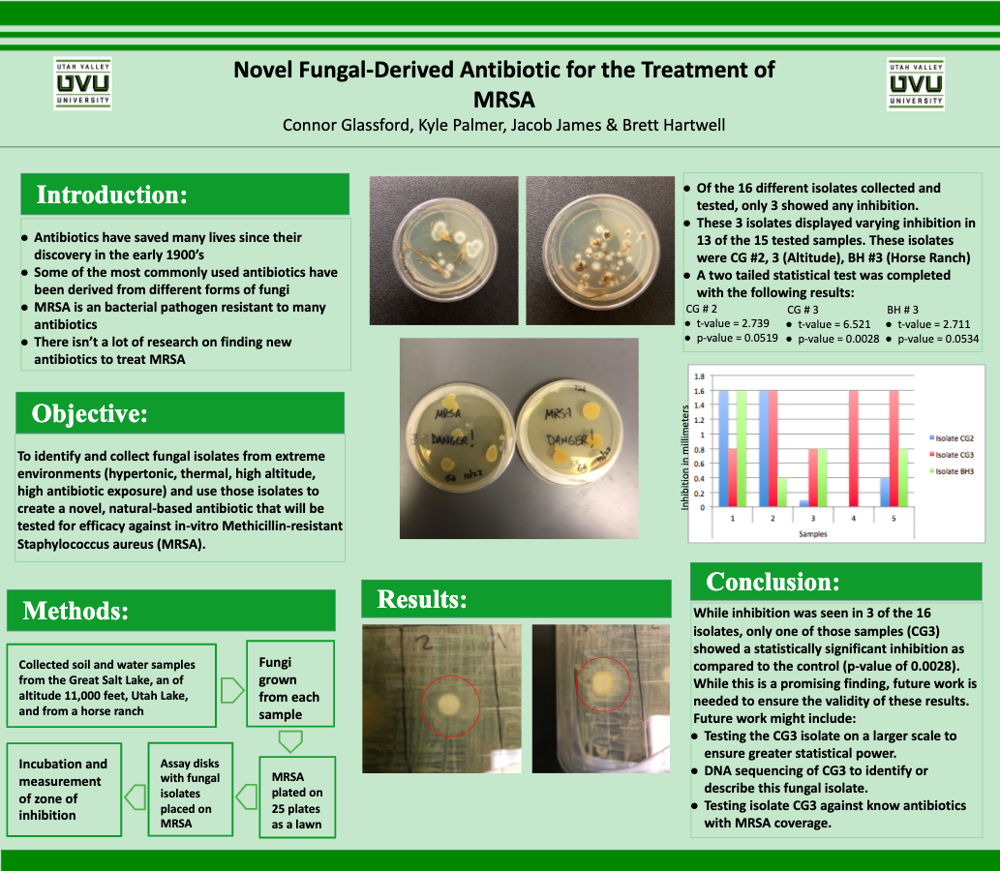

<style type="text/css">
.main-container {
  max-width: auto;
  margin-left: auto;
  margin-right: auto;
}
</style>

<style>
div.blue { background-color:#78bdcf; border-radius: 5px; padding: 20px;}
</style>
<div class = "blue">


<style>
div.lightblue { background-color:#d7f3fa; border-radius: 5px; padding: 20px;}
</style>
<div class = "lightblue">

## [HOME](https://joedidley.github.io/) | [ABOUT ME](https://joedidley.github.io/About_Me/) | [WORK](https://joedidley.github.io//Work/) | [CODING](https://joedidley.github.io//Coding/) | [RESEARCH](https://joedidley.github.io//Research) 


While attending Utah Valley University and under the direction of Dr. Zahn, myself and 3 other students attempted to find a novel fungal-based antibiotic for the treatment of MRSA. The research was unfinished, though we did get some interesting findings, which are summarized in the poster shown below:


<center>
```{r, out.width = "800px",echo=FALSE}

```
</center>

<br><br><br>

### Future research will be shared here, with links to the publications

<br><br><br><br><br><br><br><br><br>